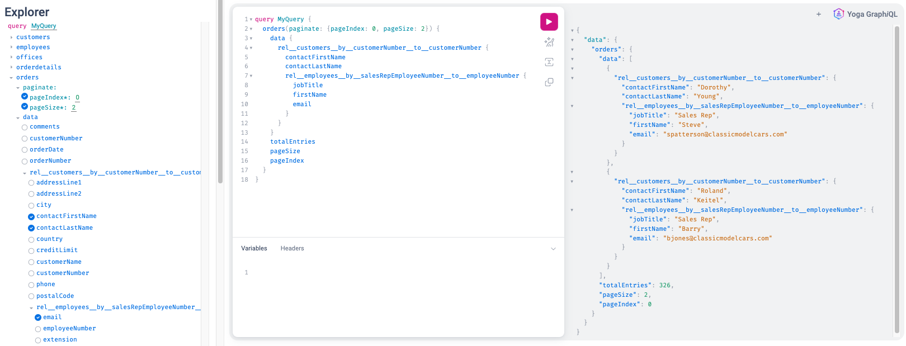
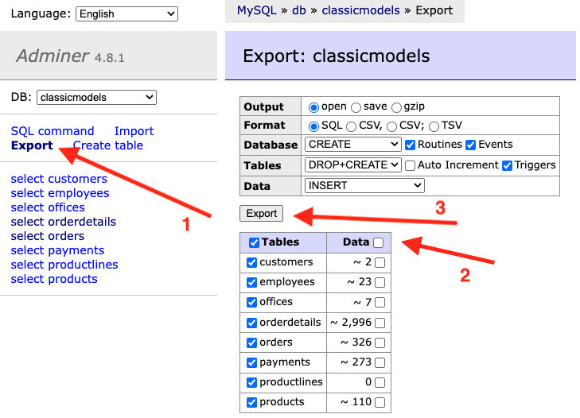

# ddl-to-gql
Convert a SQL DDL to a GraphQL implementation with all relations.

## Code generation

The _Data Description Language_ (DDL) is intended to be a SQL dialect independent language to describe how a database looks like.
For the sake of [@onn-software/ddl-to-gql](https://www.npmjs.com/package/@onn-software/ddl-to-gql), we only care about the contents of `CREATE TABLE`

```mysql
CREATE TABLE `tableName`
(
    `id`            int             PRIMARY KEY ,
    someField       varchar(50)     NOT NULL,
    `1uglyName`     bool            NULL,
    CONSTRAINT      `myConstraint`  FOREIGN KEY (`id`) REFERENCES `anotherTa ble` (`anotherId`)
)
```

Based on a valid DDL file a complete Graph is created, respecting the `FOREIGN KEY` relations. 
A complete GraphQL setup is generated, for both quering and making mutations.

```npm
npx @onn-software/ddl-to-gql --ddlPath ./example.ddl --sqlFactory knex
```

## Integrate in Yoga/Apollo GraphQL
You should bhe familiar with setting up an Apollo GraphQL server, in case you're not fully up to speed, take a look at [GraphQL Yoga](https://the-guild.dev/graphql/yoga-server). 
It's an easy way to get started with Apollo GraphQL server, our example uses it as well. 

Once you have your server running, add the following to your existing initialisation.

```typescript
import {knexQueryBuilderFactory, OnnDdlToGql} from './gen/onn/ts';
...
const typeDef = loadSchemaSync([ 
        join(__dirname, './gql/*.graphql'), 
        join(__dirname, './gen/onn/gql/*.graphql') // Add the generated .graphql to your initalization
    ], { loaders: [new GraphQLFileLoader()] }
);

const onnDdlToGql = new OnnDdlToGql<GraphQLResolveInfo>(knexQueryBuilderFactory(knex(config)));

const root: Resolvers = {
    ...onnDdlToGql.getAllTypeResolvers(),
    Query: {
        ...onnDdlToGql.getAllQueryResolvers(),
    }
};

const schema = makeExecutableSchema({
    resolvers: [root],
    typeDefs: [typeDef]
});
...
```

In this example we use [Knex.js](https://knexjs.org/) to connect to the database. 
We are agnostic from the SQL layer, by implementing our `QueryBuilder` interface any database can be connected.
In the future we want to support more databases out of the box, but as of now we only supply a `QueryBuilder` for knex.

Take a look at our example how to set up Knex.

## Run the example

We provide a complete example for you to run locally, [read more](https://github.com/onn-software/ddl-to-gql/tree/main/example).

When it's running, you can explore the data set via [Yoga GraphiQL](http://localhost:4000/graphql), it'll look like:



## Get the DDL via Adminer

The example uses Adminer for a quick and easy DB overview. You can use any tool to obtain the DDL, IntelliJ has plugins ,VS Code has plugins, there are dedicated SQL tools, or perhaps your database is provisioned from code by having the DDL committed to the repo.

One way to get it is via the Adminer UI:



## Advanced usage - Commandline

### Heuristics

Most likely you do not control the database targeted by `@onn/ddl-to-gql`. It's possible that not all relations are mapped properly.
For example there might be a missing foreign relation between `customer.orderId` and `orders.id`. Or `customer.city` and `shop.city`.
We can cross-reference the entire DDL to search for missing relations, these will be stored in the file `heurPath`. 
By default we will only look for exact name matches, and matches based on the suffix `id`. 
More suffixes can be supplied as a comma seperated list.

```
--heurPath=./onn/heuristics.json --heurSuffixes=id,anotherSuffix  --heurEnableAll
```

Another important flag is `heurEnableAll` which is disabled by default. The found relations might not be valid, 
therefore we encourage the user to inspect the output of the `heurPath` file, or explicitly rely on all heuristics by setting `heurEnableAll`.

### Column name overrides

If you do not control the database, adding foreign key relations is impossible. Based on Heuristics many relations can be recreated, 
but only if the names of colums in various tables look alike. Overrides makes it easy to rename a column, so that Heuristics can be met.
In example, suppose you have two tables, `table1` has a field `customerId` and `table2` has `'customer_id'`. 
With an override we can easily rename `customer_id`, just make sure that the name _exactly_ matches the name in the DDL.

```
--ddlOverridesPath=./onn/overrides.json

// overrides.json
{"table1": {"`customer_id`": "customerId"}}
```

### Files and Prefixes

Using `tsPrefix` and `gqlPrefix` the type names of the generated object can be modified. 
It is recommended to separate the generated definition `.json` files from the generated `.ts` and `.graphql` files
, this can be realised by utilizing the `tsFolder` and `gqlFolder` options.
You can either choose to commit the generated files to your codebase, or commit the definition files and run the code
generation step as part of your build. You could even opt to only store the source `.ddl` file, and run the generation
as part of your build.

```
--tsFolder myrProject/src/gen/onn/ts --gqlFolder myrProject/src/gen/onn/gql --tsPrefix=Onn --tsPrefix=Onn --gqlPrefix=Gql
```

### Phase selection

Instead of running everything, it is also possible to run one or more phases separate. 
This can be useful when using advanced heuristics for example. 
By default all phases are run, which is similar to: 

```
--phases=ddl,heuristics,model,repo,resolver,schema,main
```

## Licence

By David Hardy and [Onn Software](https://onn.software):

```
The MIT License

Copyright (c) 2023 David Hardy
Copyright (c) 2023 Onn Software

Permission is hereby granted, free of charge, to any person obtaining a copy
of this software and associated documentation files (the "Software"), to deal
in the Software without restriction, including without limitation the rights
to use, copy, modify, merge, publish, distribute, sublicense, and/or sell
copies of the Software, and to permit persons to whom the Software is
furnished to do so, subject to the following conditions:

The above copyright notice and this permission notice shall be included in all
copies or substantial portions of the Software.

THE SOFTWARE IS PROVIDED "AS IS", WITHOUT WARRANTY OF ANY KIND, EXPRESS OR
IMPLIED, INCLUDING BUT NOT LIMITED TO THE WARRANTIES OF MERCHANTABILITY,
FITNESS FOR A PARTICULAR PURPOSE AND NONINFRINGEMENT. IN NO EVENT SHALL THE
AUTHORS OR COPYRIGHT HOLDERS BE LIABLE FOR ANY CLAIM, DAMAGES OR OTHER
LIABILITY, WHETHER IN AN ACTION OF CONTRACT, TORT OR OTHERWISE, ARISING FROM,
OUT OF OR IN CONNECTION WITH THE SOFTWARE OR THE USE OR OTHER DEALINGS IN THE
SOFTWARE.
```
